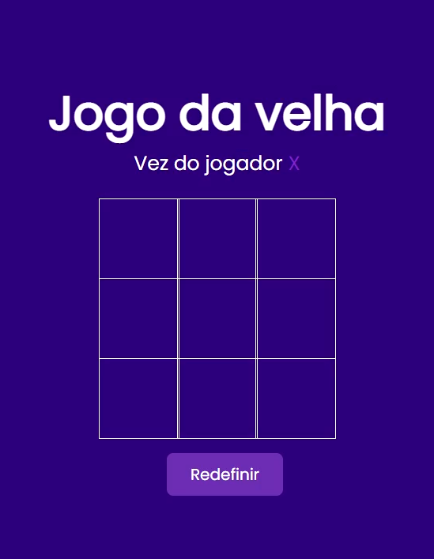

<p align="center">
   
</p>

<h1 align="center">Tic-tac-toe</h1>

<h3 align="center">
  :rocket: Simple game developed using only HTML, CSS and JavaScript 🚀
</h3>

<p align="center">
  
</p>

# :computer: Technologies

This project was made using the following technologies:

* [HTML](https://developer.mozilla.org/pt-BR/docs/Web/HTML)
* [CSS](https://developer.mozilla.org/pt-BR/docs/Web/CSS)
* [JavaScript](https://developer.mozilla.org/pt-BR/docs/Web/JavaScript)

## How to Start?

### Requirements

**Clone the project and access the folder**

```bash
git clone https://github.com/DiogoAMV/tic-tac-toe.git && cd tic-tac-toe
```

**Follow the steps below**

```bash
# In the root folder of the project, access the file 'index.html'
# start the application (I use the live server)
```

## :memo: License

This project is under the MIT license. see the file [LICENSE](LICENSE.md) for more details.

---

Feito com :purple_heart: by [Diogo Marques](https://github.com/DiogoAMV)

[](https://www.linkedin.com/in/diogo-marques-719950221/) 
[](mailto:contato.diogoamv@gmail.com)
